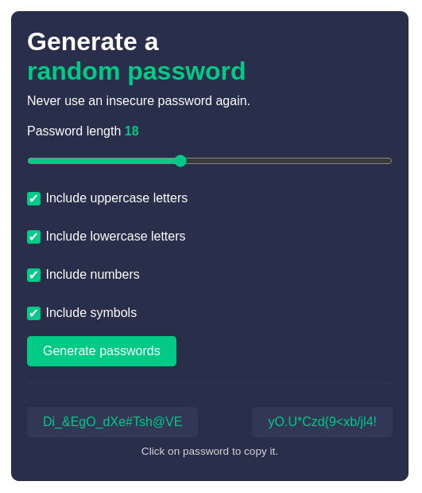

# Random Password Generator

## Screenshots

## Table of Contents
* [Description](#description)
* [Installation](#installation)
* [Screenshots](#screenshots)
* [Usage](#usage)
* [Credits](#credits)

## Description
This application generates two random passwords when a user clicks the "Generate Password" button. The user can then copy the password to their clipboard by clicking directly on the password. The passwords are generated using JavaScript. The user is prompted to enter the length of the password. The length of the password is 15 characters.

## Installation
To install this application, clone the repository and open the index.html file in your browser.

## Usage
To use this application, click the "Generate Password" button.
To copy the password to your clipboard, click directly on the password.

## Credits
This application was created by [Coder Suresh](https://github.com/codersuresh) as a part of scrimba's solo project challenge.
